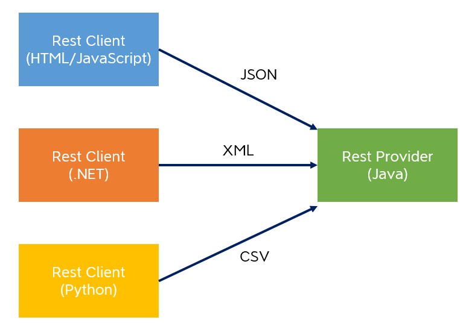
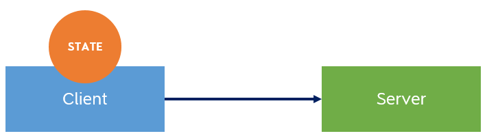
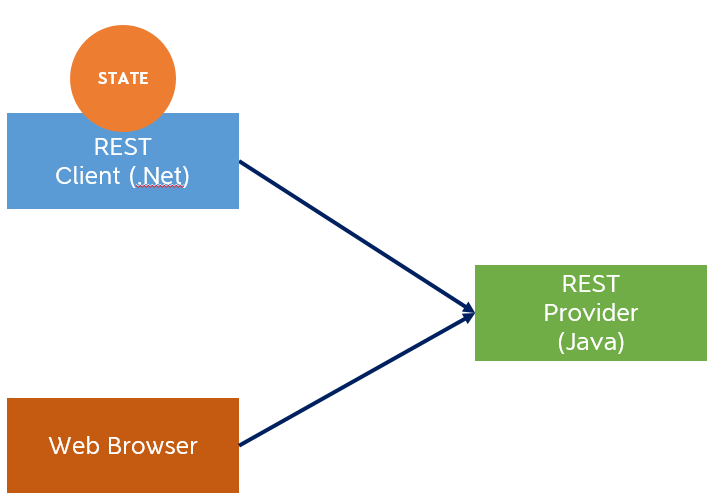
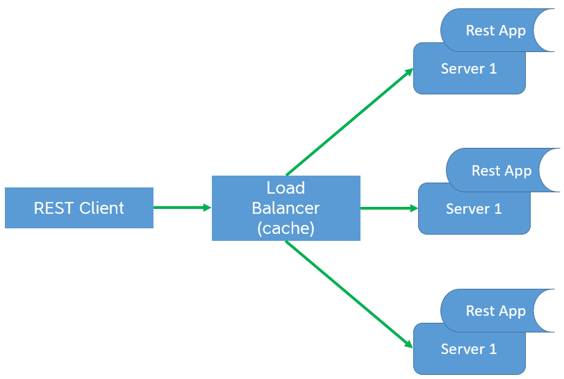

## 1. Introduction:
In this section, we will master all the concepts of the RESTful services that are required before we **design** or **implement** them.
By the end of it, we will be able to know:
* What REST services are.
* How HTTP has reborn with REST.
* All the advantagesof RESTful web services.
* When to use RESTfUl in our applications.

***

## 2. REST Overview:
REST stands for : **REpresentational** **State** **Transfer**. 
If we watch a video from Youtube, we are acting like a REST web service consumer and this Youtube website acts like a RESTful provider.
(Streams the video back to your browser).
RESTful bases on the power of HTTP.

1. Rest is Stateful: the first RESTful principle is to provide a unique single interface to perform the previous four operations (known as **CRUD**).
  * HTTP Methods: HTTP provides a unique interface to perform **CRUD** operations through:
    * CREATE
    * GET
    * PUT
    * DELETE
  * URI: we can use **Uniform** **Resource** **Identifiers** to uniquely identify a particular resource that we want 
  to **READ**, **CREATE**, **UPDATE** or **DELETE**.
  
**Example (Usecase)**: Let's consider a Hospital Management Software which allows us to perform CRUD operations on patient data.
* To create a patient (**Perform a POST request**): 
we simply use the HTTP POST method from our web browser or RESTful consumer written in some language and send
in the request with **URI**.
    * We will send an XML which contains patient information.
    ```xml
        <patient>
            <name>John</name>
        </patient>
    ```
    * The RESTful provider will send an HTTP status (**200 OK**) when it creates the patient in the database.
    * It sends back the unique number for that particular patient which is the unique **id**.
* To get patient data (**Perform a GET request**): at a later point in time in our application 
    * using **HTTP GET** by passing the unique **id**.
    * The provider will then take the unique id.
    * Provider returns a HTTP response code (**200 OK**).
    * It sends back the entire patient information.
* To make an UPDATE operation (**Perform a PUT request**):
    * we will use the PUT method and pass in the entire patient information as **XML**. 
    * Provider returns a HTTP response code (**200 OK**).
    * The provider will then update the aimed patient data.
    ```xml
           <patient>
               <id>1</id>
               <name>John</name>
           </patient>
    ```
  
* To make DELETE operation (**Perform DELETE request**): to delete the patient information
    * Hit the URI with the unique identifier of the patient.
    * Provider returns a HTTP response code (**200 OK**).
    * The aimed patient information will be deleted.
    
Finally, we will have one single interface as programmers (HTTP Methods).

**Note**: we don't need to learn any methods that are specific to a particular application.

* RESTful supports multiple data formats because HTTP supports MIME (**Multipurpose Internet Mail Extensions**) types.

We can consume and produce. A REST provider can consume and produce data in multiple formats. for example:

    ```xml 
        <patient>
            <name>John</name>
        </patient>
    ```
If a **Java** application is communicating with **.net** application, we might need the data in XML so that it can be easily converted into
**.net objects** or **Java objects**.

If we are developing a web application which uses `HTML` and `JavaScript`:
`JavaScript` can understand `JSON` (**JavaScript Object Notation**). So a RESTfull provider can provide the data JSON format as well. and also
text and many other formats. 
**Note**: If we need data like: images, video stream ... we can do all that by specifying `HTTP MIME` type.

2. Rest is stateless: it doesn't mean not having state at all, but exchanging the Representational state between applications.
The provider will send the state back to the consumer and vice versa.
    * We can maintain the state on the client side instead of maintaining the entire state on the server side.
    
3. To summarize:
   * REST uses the complete power of HTTP:
        * provides a single HTTP Interface.
        * provides an easy way to access.
        * has a Multiples Representations.
        * allows Scalability because Stateless (deployed on several servers as the user based grows). 

***

## 4. WHY RESTFul  - The  Advantages:

* We will learn why we should use REST web services to build our applications. Every software application offers **CRUD** operations:
    * All we need is **URLs** o easily access our RESTful services or to design our RESTful providers.
    * For example from ============== `http://www.hostpital.com/patients` and using the GET HTTP method: 
    * If we want to retrieve one single patient's information `/patients/{id}`
    * If we want to retrieve all the prescriptions of a particular patient  `/prescriptions`.
    * If wa want to get one prescription `/prescriptions/{id}`.
    
* RESTful web services deliver interoperability which meaning any application running on any platform written in any language can be
consumed by any other application running on a completely different platform

   

* Stateless : All it means is that the state will be maintained on the client instead of our application or the REST provider.
    * Old school applications :
    
     
    
    We used to have our application deployed on a server, and then we used to install a client application on each and every machine which
    needed our application. those clients' application, used to maintain the entire state. (manipulating the entire state on the client side).
    
    * With modern application:
    
    
    
    We don't have to install software on each and every machine in the web browsers (accessing the web applications via browsers). By the introduction
    of sevral JavaScript libraries like Ajax and JQuery, maintaining the state on the browser or in the browser becomes very easy and that is 
    the trend now.

* Scalability: as the number of users grows, we can easily scale into multiple servers. thanks to our application which Stateless,
we easily our application to multiple servers through a load balancer. 

    
 
Since HTTP is stateless, HTTP requests can be easily cached, no matter how many times we perform  GET, PUT and DELETE operations, the state of the application will not be 
affected. So our responses can be easily cached and that will improve the performance of our application tremendously.
    
    
***

## 6. When to use RESTFul Web Services:

This lecture will help you decide when to choose REST web services for your applications:
* Well defined contract exists: RESTful Web services should be used when the service producer and consumer have a mutual understanding
    of the contract already in place:
    * how the data will be exchanged.
    * what data will be exchanged.

    **Note:** Because unlike in case of SOAP web services, where we have web services description language or the WSDL file, we do not have a way to express
    the contract in case of REST web services.        

    In realtime applications where we use RESTful services, we provide a lot of documentation and examples of this contract, and a lot of sample messages
    in various formats like XML, JSON, text etc.

* Multiple Data Formats: REST supports multiple data formats. (XML, JSON, plain text and a lot of other formats). 
    
    **Note:** the SOAP counter part only supports XML.

* Bandwidth and Memory: For devices like mobile phones, tablets which cannot handle the overhead of SOAP XML elements due to less memory or bandwidth,
REST eliminates this overhead by providing simple XML

* Stateless: if your application survives a server restart. That's your application behaves the same way where it was befaure the restart even after restart
than your application is stateless.

* Caching : through this we improve the performance of our application instead of creating this response every time, we send out the response from 
the cache. These caching frameworks are there and will work out of box. we will just configure them.

* Existing Logic can be exposed easily: existing web sites and the logic in them can be exposed in RESTful style. Any new user interface can 
consume these RESTful services either in XML or JavaScript. That's will increase the developer productivity and save a lot of time.

***

## 7. Section Summary: