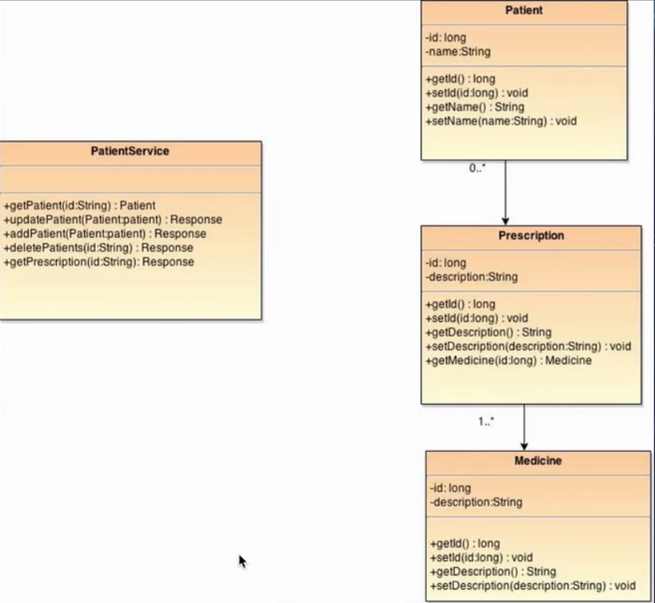
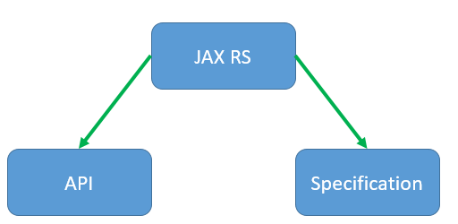
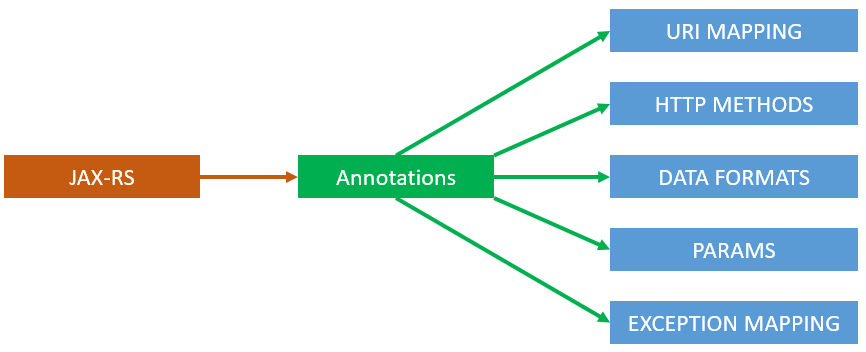

## 1. Introduction
We are going to start this section by 

   * learning the four simple steps that are required to design a RESTful.
   * moving on to the implementation of RESTful services by learning what JAX-RS is and the important annotations in the JAX-RS API.
   * implementing a Patient Management RESTful web service which supports both XML and JSON requests and responses.
   * understanding how to test a RESTful web services using REST plugin this is available for Chrome web browser.
   * learning how to implement RESTful clients, web service clients for your applications both in Java and JavaScript in our web applications.

***

## 2. REST Design:
we will design a Patient Management application which allow us to ADD, READ, UPDATE and DELETE patient information and all of his prescriptions and medication
information. We will do this in the following four simple steps:
   1. Identify the resources: the objects needed to be exposed out as REST service. we will use the object model, or the class diagram for our application:
   
        
   
         * Patient can have multiple prescriptions.
         * Prescription can have multiple medicines.
         * The PatientService contains the CRUD operations to manipulate the previous classes.
       
       this three classes considered as a Data Transfer Objects
   
   2. Create the URIs to access those resources: will allow us to easily access these resources.
        * Creating a Patient: pass the data to `/patients`.
        * Reading a Patient: by passing the unique id to `/patients/{id}`.
        * Updating a Patient: pass the data to `/patients`.
        * Removing a Patient: pass the unique id to `/patients/{id}`.
   
   
   3. Assign the HTTP methods: to assign the HTTP methods to perform the four CRUD operations.
         * Creating a Patient: `POST`.
         * Reading a Patient: `GET`.
         * Updating a Patient: pass the data to `PUT`.
         
         **Note**: don't use `POST` (Because we don't want to change the state of the application).
         
         * Removing a Patient: pass the unique id to `DELETE`.
   
   
   3. Choose the data format: to come up with the request and response messages using that particular data format.
        * Read:
             
             * Request: /patients/123
             * Response
             
                 ````xml
                      <Patient>
                        <id>123</id>
                        <name>DIAB</name>
                      </Patient>
                 ````
                     
        * Create:
             * Request:
             
                  ```xml
                   <Patient>
                       <name>ABDOU</name>
                   </Patient>                       
               ```
             * Response:
                
                  ````xml
                       <Patient>
                        <id>124</id>
                        <name>DIAB</name>
                      </Patient>
                  ````
             **Note**: The id here is got generated on the server side.  
                        
        * Update:
             * Request:
                  ````xml
                       <Patient>
                           <id>124</id>
                           <name>ABDELHALIM</name>
                       </Patient>
                  ````     
             * Response: HTTP / 1.1 200 OK
                          
        * Delete:
             * Request: /patients/123
             * Response: HTTP / 1.1 200 OK
             
                          
        
   **Note**: We are going to choose `XML` for this use case (JSON for later).
   

***

## 4. JAX-RS:

**JAX RS** stands for `Java` API for `XML` based REST Services. It is the standard for implementing the REST services in the Java Enterprise Edition.

   
    
   * Specification is for engines or stacks. (a set of rules and guidelines written in plain english - Implemented by Apache CXF or Jersey). 
   * API is for the developers: set of annotations which facilitate our job easy. (part of `javax.ws.rs` package)
   
   | Annotation | Description |
   | --- | --- |
   | `@Path("/users/{username}")` | mark our java classes and methods with a relative **URI** path|
   | `@POST` | called when the client uses a `POST` method in the request|
   | `@GET` | called when the client uses a `GET` method in the request|
   | `@PUT` | called when the client uses a `PUT` method in the request|
   | `@DELETE` | called when the client uses a `DELETE` method in the request|
   
   * Rest supports multiple data formats and there are annotations like:
   
   | Annotation | Description |
   | --- | --- |
   | `@Consumes("text/plain")` | specify the kind of data this particular REST provider can accepts (get it from the client)|
   | `@Produces({"application/json","application/xml"})` | specify the kind of data this particular REST provider can produce (send back to the client) | 
   
   All the previous types are `HTTP` `MIME` types, and you can have multiple MIME.
   
   * How to map request parameters to Java Objects ? via specific annotations:
   
   | Annotation | Description |
   | --- | --- |
   | `@PathParam`  | map values that come in the `URI` to a `Java` object |
   | `@QueryParam` | map request query parameters in GET method to `Java` object automatically |
   | `@FormParam`  | map the parameters that come in during a form submission to `Java` object |
   
   * JAX-RS provides an Exception Mappers are an easy way to implement Exception mapping using `@Provider` annotation:
   
   | Annotation | Description |
   | --- | --- |
   | @Provider | to implement a custom exception mappers to map `Java` application exceptions to HTTP error codes |
  
  
   **Note**: All the previous `Annotations` are runtime annotations. So **Apache CXF**, **Jersey** read these annotations at runtime and take the appropriate
   actions.
   
   
   

***

## 6. Create the project: 
The creation of this project will base on the following steps:

* Creating the Spring boot Project.
* Create the Beans.
* Create the endpoints.
* Mark them with Annotations.
* Configure

***

## 7. Create the classes and annotate them:

***

## 8. Implement the init method:

***

## 9. Implement the GET all Patients method:

***

## 10. Publish the endpoint:

***

## 11. Test GET All:

***

## 12. GET single patient:

***

## 13. Create a Patient:

***

## 14. Test Create:

***

## 15. Update Patient:

***

## 16. Test Update:

***

## 17. Delete a Patient: 
