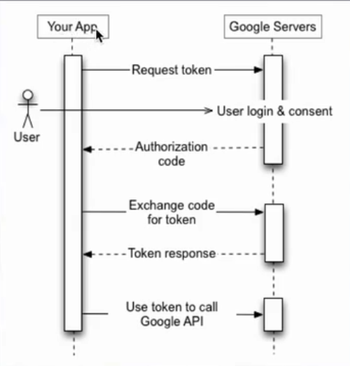

## 1. What is OAuth?

When we access a secured web application, it verifies our identity at first by logging us in and then it ensures
that we have access only to that data or functionality in the application we are authorized for.
So, the basic requirements are identity and permissions or authentication and authorization.
* REST application are lightweight applications and are no exception to this kind of access. 
* OAuth is an authentication and authorization standard which allows an application to gain access to user's
data within another application without knowing the user's user ID and password for the second application.

 * Here, the user who is using application A and application A want to get some data which application B has 
 which is for the user.
 * Instead of the user sharing his user ID and password f application B with A, through OAuth, application A
 will redirect the user to application B where he will log in.
 * From that point in time, application B will share a security token with application A using which these two
 communicate and application A will get all the data which it requires from application B.
 * This process of logging in and getting authorized, is covered in the OAuth standard.
 
 **Example**:
 Let's say you are watching technical videos or reading articles on a popular website like `udemy.com` or 
 `javaworld.com` and you want to voice your opinion on an article in the comments section. `javaworld` want
 you as an end user to authenticate first by logging in, instead of you registering on `javaworld` will use 
 the services provided by Google because most of us has a Google login.It will redirect you to a Google login
 page, where you will login and then from that point, `javaworld` and Google will communicate to see if you are
 really a user of Google. 
 
 **Note**: This process of one application using another application to login or to authenticate is called:
 **Federated authentication**, and it is one of the important pieces of the OAuth standard.
 
 * **Delegated Authorization**: Let's say you have used a website that allows you to file your income tax returns
 online and at the end, it produces a bunch of tax return documents which it allows you to save to your Google
 Drive. You as an end user, instead of sharing your Google username and password with the tax website, you are
 redirected, this tax website is using OAuth will redirect you to the  Google login page. You will have to
 enter your Google username and password and from that point the tax website will be able to access your 
 Google Drive through Google's security token, and it can only access your Google drive and not your Google
 mail nor Google Docs.This process of authorization is called delegated authorization because this tax website
 is **delegating authorization** because this tax website is delegating the entire authorization process, or 
 you are delegating the authorization process to another application as an end user.
 
 OAuth is a standard that defines the rules so that any application can be a part of this entire flow to do 
 the **Federated authentication** and delegated authorization. That is a user grants access to an application
 to perform actions on the user's behalf, and the application can only perform those actions which, you the user
 authorizes it to do. 
 
 
 
 
***

## 2. Why, When and When not to **Use** OAuth:

Let's say we are approached by various companies or placement firms who are looking for `Java` web services
developers. While you submit your resume through their website, instead of creating an account or profile with each
of these Job portals, they can give you an option to pull your information from `LinkedIn` or `Facebook`.
Are you ready to share your username and password of `LinkedIn` with all these job portals? off course, no, 
because we can't trust each and every website out there. Instead, these job portals or placements firms websites
will redirect you to the `LinkedIn` website where you will enter your username and password. From that point,
these job portals will communicate with `LinkedIn` and retrieve all the profile information, and your resume as
required.

**Why?**
* **Trust** : is number one advantage of using OAuth.
* **Stealing** : let's say we have trusted all these websites, and we did give them our username and passwords 
which will result in our username and password saving, getting saved everywhere, and we enter our username
and password for each of these websites , which will increase the changes of stealing our username and password
and changes of phishing scams going up. Without OAuth protocol, once you give access to these portals to your
`LinkedIn` profile or `Facebook` profile, they can access everything from your contacts to photos to videos ...
if we don't have authorization in place. 
* **Unlimited Access** : So OAuth also, as you know authorization, and these job portals can only
access that part of `LinkedIn` which you will give them access to, when you are logging in.
Finally, the OAuth Standard also specifies how an end user accessing an application can revoke the permissions
at some point. 
* **Revocation** : If there is no standard, you will give your `LinkedIn` access to these job portals but how do you
take it back? So there is a revocation standard also as part of OAuth.
 
 
**When?**

OAuth is not a simple authentication mechanism, or a single sign-on mechanism. OAuth fits into the applications,
or it is the choice of web application, that itself uses another web application's API on behalf of the user.
It gives the web applications a secure way to get an access token, like in case our job portal example, 
the access to `LinkedIn` was given to the job portals. From that point in time, they both communicate with each
other.

**When Not to use OAuth?**

We should not use OAuth for simple applications, it will be overkill. For simple applications, we can use 
`HTTP` basic r form based authentication over `SSL`. Always remember that, if you have a simple RESTfull web
service, wherein you need not, or you do not need this particular scenario of one application accessing another
application where it has user's data.

***

## 3. OAuth Workflow - (How it works?):

We will understand how the OAuth workflow works, and the various roles that are involved in this workflow.
Getting back to our `JavaWorld` example, where we as developers are accessing `JavaWorld` and reading some
cool articles on it and, we want to express our opinion by commenting on an article. To do this, `JavaWorld`
allows us to login via Google and then it uses OAuth from that point to communicate with Google and get out
authentication information.

The first step in the OAuth workflow is `JavaWorld` registering itself with Google since it is going to use
the Google services to retrieve the user's data once the user gives it the permissions to do so. It registers
and gets a client ID back, 
 * `JavaWorld` registers with Google and gets a **client ID**.
 * `JavaWorld` will redirect him to Google website once the user access to the website. It redirects us to 
 a `URL` which contains some parameters: 
   * A **client ID** from the previous step.
   * A **state** as unique number or code that `JavaWorld` generates which is the current session state of that
   user.
   * A `URL` which Google should redirect to once the user authenticates.
 * The user will enter the login details on the Google page. Google authenticates him, and it will redirect him 
 back, using: 
   * A `URL` with the state which `JavaWorld` has forwarded.
   * A `Unique code` which Google generates.
 * `JavaWorld` from that point, will take that code and send in another `HTTP` request to Google.
 * Google will give it back a `Unique token`.
 * `JavaWorld` will use the previous token for any number of requests that it will send to Google to get the
 user information and access whatever the user allows `JavaWorld` to access on Google.
 
 
 
   * **Roles**:
      * **Resource Server**: the server that hosts resources, and it protected by OAuth.
      * **Resource Owner**: the end user (in our case `JavaWorld`) who wanted to comment.
      * **Client**: not the end user, but it is the application which wants to access the resources of the 
      end user on a protected **Resource Server**.
      * **Authorization Server**: the one which generates the unique code and then the tokens.
      
      **Note**: Typically in many applications, **Resource Server** & **Authorization Server** can be on the
      same machine or even in the same application.
      
 * **Variation in implementation**: In reality, sites like Google, Facebook and Twitter don't use OAuth protocol
 exactly, but they put some of their own spin on it and all have a little different way of implementing this
 protocol. This is because the OAuth specification is more a set of detailed guidelines rather than a specific 
 protocol set in stone. It leaves out several details like how a user or OAuth client authenticates or what
 additional parameters must be sent. So, if you are using OAuth on your application to integrate with another
 application that supports also OAuth, there might be some specific knowledge you might have to gain about
 that particular application but overall, il will fit into this big picture.
 
 * **OAuth Support**: there are several `Java` frameworks out there that can help you turn your application into 
 OAuth resource servers or OAuth clients to integrate with a resource server like Google, Twitter ... by going to
 [OAuth website](https://oauth.net).
    
***

## 3. OAuth Google Play Ground:

One of the easiest and great ways to get a feel of the entire OAuth protocol and, also see it in action is by
going to the `Google OAuth playground`.

